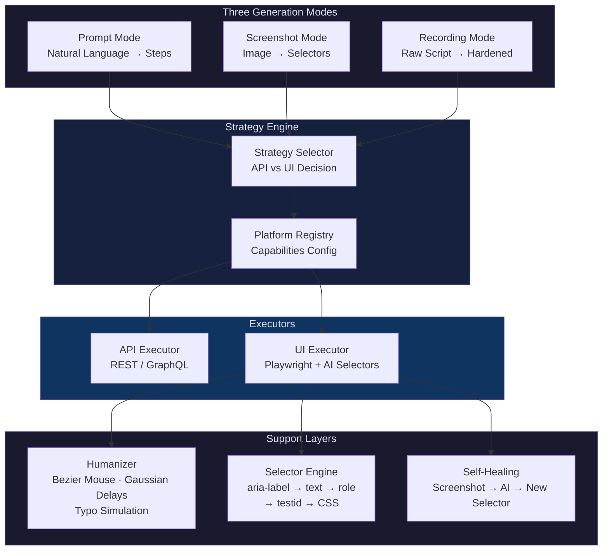
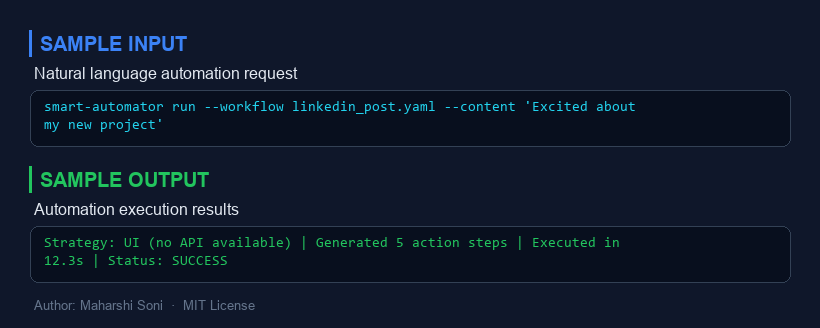
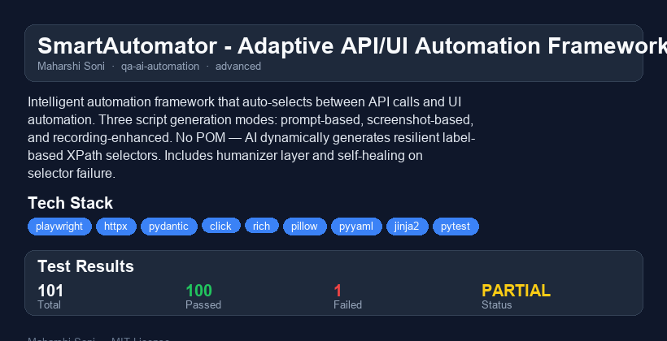

# SmartAutomator - Adaptive API/UI Automation Framework

An intelligent automation framework that auto-selects between API calls and UI automation based on platform capabilities. Three script generation modes: **prompt-based** (natural language to script), **screenshot-based** (vision analysis to selectors), and **recording-enhanced** (recorded actions hardened by AI). No Page Object Model needed — AI dynamically generates resilient label-based XPath selectors from live page state.

## Architecture



## Why I Built This

After 5 years of building automation frameworks at PwC — from TestCafe Page Objects to Playwright scripts across 15 insurance lines — I realized the biggest bottleneck isn't writing tests, it's maintaining them. Every UI change breaks selectors. POM helps but doesn't solve it. So I built a framework where **AI IS the page object**. You describe what you want, show a screenshot, or record a flow — and AI generates resilient automation that self-heals when the UI changes. No POM files to maintain. No locators to update. The AI looks at the page and figures it out.

## Key Innovation: No POM, AI-Driven Selectors

Traditional frameworks maintain Page Object Model files with hardcoded selectors. When the UI changes, selectors break and tests fail. SmartAutomator eliminates this:

| Traditional (POM) | SmartAutomator (AI) |
|---|---|
| Hardcoded selectors in POM files | AI generates selectors from live page |
| Selectors break on UI changes | Self-healing finds new selectors |
| Manual locator maintenance | Zero locator maintenance |
| CSS/XPath priority | Label-based priority (aria-label > text > role) |
| One selector per element | Multiple fallback selectors per element |

### Selector Priority Order

```
1. aria-label    → [aria-label="Submit"]         (most stable)
2. visible text  → text=Submit                   (user-facing, rarely changes)
3. role          → role=button[name="Submit"]     (semantic, stable)
4. data-testid   → [data-testid="submit-btn"]    (dev-controlled)
5. CSS class     → button.submit-btn             (least stable)
```

## Three Generation Modes

### Mode 1: Prompt-Based
```bash
smart-automator run "Post 'Hello World' on LinkedIn" -p linkedin
```
Natural language instruction → AI generates action steps → executor runs them.

### Mode 2: Screenshot-Based
```python
from smart_automator.generators import ScreenshotGenerator

generator = ScreenshotGenerator()
sequence = generator.generate("page.png", "Click the blue Submit button")
```
Screenshot + instruction → AI vision finds elements → generates selectors.

### Mode 3: Recording-Enhanced
```bash
smart-automator enhance recording.py -p linkedin -o hardened.py
```
Raw Playwright codegen output → AI replaces fragile selectors → adds humanizer and error handling.

## Smart Strategy Selection

The framework automatically picks the best execution method:

```python
# Platform has API → uses API (faster, more reliable)
# GitHub: create_issue → REST API call

# Platform has no API → uses Playwright UI
# LinkedIn: post_content → browser automation

# Mixed workflow → hybrid execution
# Post to LinkedIn (UI) + create GitHub issue (API)
```

## Humanizer: Indistinguishable from Human

Not just `random.uniform()` delays:

- **Gaussian delays**: Bell-curve distribution around natural human timing
- **Bezier mouse**: Curved mouse paths with acceleration/deceleration
- **Realistic typing**: Variable speed, common digraph acceleration, occasional typo + correction
- **Natural scrolling**: Variable increments with reading pauses and overshoot correction

## Installation

```bash
pip install -e ".[dev]"
```

## Quick Start

```python
from smart_automator.strategy import PlatformRegistry, StrategySelector
from smart_automator.models import ActionSequence, ActionStep, ActionType, Selector

# Load platform configs
registry = PlatformRegistry(Path("platforms"))

# Strategy selector auto-picks API vs UI
selector = StrategySelector(registry)
strategy = selector.select(my_sequence)  # Returns API, UI, or HYBRID
```

## CLI Commands

```bash
# Run automation from natural language
smart-automator run "Create an issue titled 'Bug Fix'" -p github --dry-run

# Enhance a raw Playwright recording
smart-automator enhance recording.py -p linkedin -o enhanced.py

# List registered platforms
smart-automator platforms

# Show scheduled tasks
smart-automator schedule

# Framework info
smart-automator info
```

## Platform Configuration

Add new platforms by creating YAML configs:

```yaml
name: my_platform
display_name: My Platform
base_url: https://example.com
has_api: true
api_base_url: https://api.example.com
preferred_strategy: api
rate_limit:
  requests_per_minute: 30
auth:
  method: token
  token_env_var: MY_PLATFORM_TOKEN
```

## Performance

| Metric | Value |
|---|---|
| Script generation from prompts | ~3 seconds |
| Self-healing selector recovery | <5 seconds |
| API execution (GitHub issue) | <1 second |
| UI execution with humanizer | 5-15 seconds (realistic pacing) |

## Tech Stack

- **Playwright** — Browser automation engine
- **httpx** — Async HTTP client for API execution
- **Pydantic** — Type-safe models and validation
- **Click + Rich** — CLI with styled terminal output
- **Pillow** — Screenshot analysis
- **PyYAML** — Platform and workflow configuration
- **Jinja2** — Script template rendering
- **pytest** — Testing with full mock coverage

## What I Would Do Differently

- **Browser fingerprinting**: Add Canvas/WebGL fingerprint rotation for production-scale automation. Current anti-detection covers basic navigator.webdriver override but not advanced fingerprinting.
- **Proxy rotation**: Integrate residential proxy rotation for multi-account scenarios. Current design assumes single-IP operation.
- **Visual regression**: Add screenshot comparison to detect UI changes before selectors break, rather than only healing after failure.
- **LLM caching**: Cache LLM responses for identical page structures to reduce API calls and improve speed.

## Scaling Considerations

- **Concurrent browser instances**: Use Playwright's browser context pool with configurable max concurrency. Each context gets isolated cookies/storage.
- **Session pooling**: Maintain a pool of authenticated sessions to avoid repeated login flows. Sessions refresh on expiry.
- **Rate limit coordination**: Centralized rate limiter across all concurrent tasks targeting the same platform.
- **Distributed execution**: Worker-based architecture with a central scheduler distributing tasks across multiple machines.

## Testing

```bash
pytest tests/ -v
```

All tests use mocks — no real browsers, no real API calls, no paid services.


---

## Sample Input / Output



---

## Project Overview



### Reports
- [HTML Report](reports/smart-automator-report.html) - interactive report
- [PDF Report](reports/smart-automator-report.pdf) - downloadable PDF
- [TXT Report](reports/smart-automator-report.txt) - plain text

## License

MIT License - Maharshi Soni
